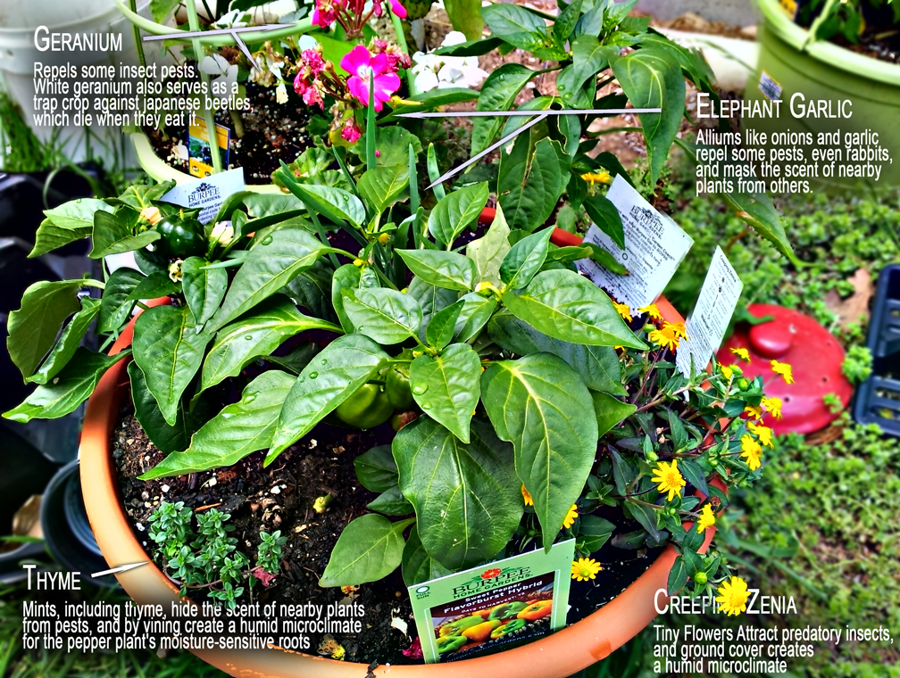

*this is a working in progress* 

# Companion planting dataset and network visualization

Companion planting is planting of different crops in proximity for a specific, beneficial reason. These reasons could include pest control, pollination, providing a habitat for beneficial insects, maximizing space, increase crop productivity, etc. This is a dataset created from scraping the wikipedia page on companion planting and will be eventually used to create a network visualization of plants!: https://en.wikipedia.org/wiki/List_of_companion_plants

